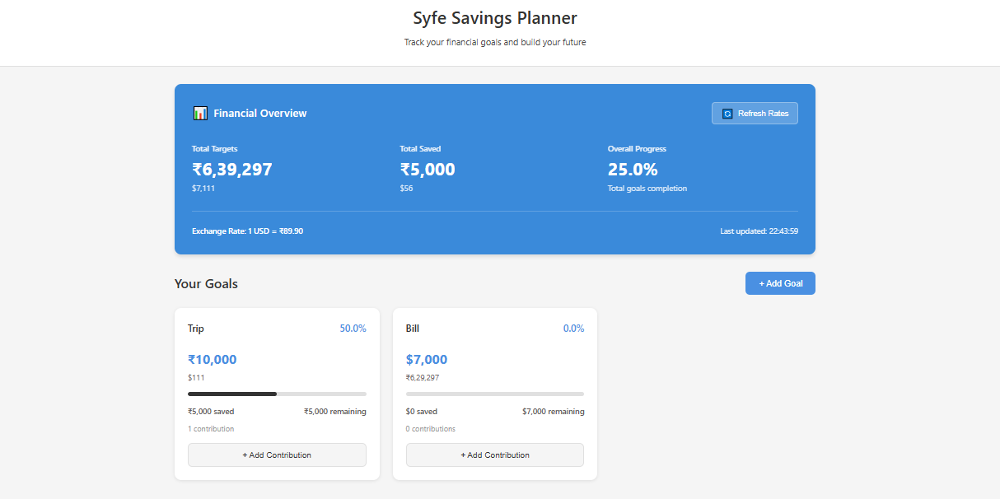

# Saving_Project

🔗 Live Demo:
https://saving-planner.netlify.app/

A responsive Savings & Goals Planner built with React + Vite that helps users:

- Create financial goals in INR or USD

- Track contributions over time

- View overall financial progress in a dashboard

- Automatically convert between USD ↔ INR using live exchange rates

- Persist all data in localStorage

✨ Features

- Create, view, and track multiple financial goals

- Add contributions with date and amount

- Progress tracking with visual progress bars

- Financial Overview dashboard:

  - Total targets

  - Total saved

  - Overall progress %

- Multi-currency support (INR & USD)

- Live USD → INR exchange rate

- Fully responsive UI

- Data persistence using localStorage

✨ Tech Stack

- React (Vite)

- JavaScript (ES6+)

- CSS

- ExchangeRate API

⚙️ Setup Instructions

1. Clone the repository

   git clone https://github.com/princika24/Saving_Project.git

   cd Saving_Project

2. Install dependencies

   npm install

3. Create .env file in thhe root of the project

   VITE_EXCHANGE_RATE_API_KEY=your_api_key_here

4. Start the server

   npm run dev

✨ Website Screenshot

✨ Data Persistence

- All goals and contributions are stored in:

  localStorage -> "savings_planner_goals"

- Exchange rate is cached with timestamp.

  - It works even after refresh

  - It works even if API fails (uses cached rate)

✨ Running Tests

This project uses Vitest for unit testing.

- Run test in watch mode

  npm run test

  This will :

  - Start the test runner

  - Automatically re-run tests when file changes

  Press q to stop
